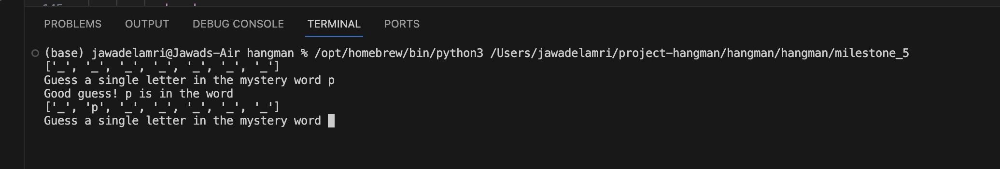

# Hangman - Project
Second python project completed for AiCore 

October 2023

## Summary 
Hangman is a classic game in which a player thinks of a word and the other player tries to guess that word within a certain number of attempts.

This is an implementation of the Hangman game, where the computer thinks of a word from a selected list of fruits and the user tries to guess it within a given number of turns.  

This project has been a fun way to get to grips with python, exposing me to a range of fundamental techniques and features to ensure a solid foundation and build transferable skills. Such as implementing and following the practices  of object-oriented programming.

## Installation instructions 
Clone this repo in your terminal using the link provided at the top of this page. It should look like this:

     git clone https://github.com/JawadElAmri/hangman.git

Then enter the directory containing this project: 

     cd hangman 

## Usage instructions
Launch milestone_5 in the terminal

      python3 milestone_5

You can then run the script in the terminal, and you will be greeted with a list of blank spaces. This is mystery_word picked at random from the word_list. As seen below in the VS code screen shot.

You will be given five lives to enter a guess of a letter in the mystery_word, for each correct guess the letter will be revealed, and you'll be shown its placement in the mystery word. As seen below. For every incorrect guess you will lose a life. 

If your guess has more than one character or is a number. You will be told to make another guess or if you enter the same guess, you'll be reminded that letter has been entered before.

If you end up on 0 lives it means you have lost the game. If you guess all the letters before running out of lives you have won, the game.

To play the game again, clear your terminal and run the script again.

 

## File structure of the project
There are several files associated with this project:
- Image for README.md file

- hangman_Template.py

     Template file provided by AiCore
- milestone_2.py

    First task set up initial variables of the game
- milestone_3.py

    Second task check if the guessed character is in the word
- milestone_4.py
    
    Third task create the game class
- milestone_5.py 
    
    Final task create the game logic 

## License information
My project is unlicensed 

